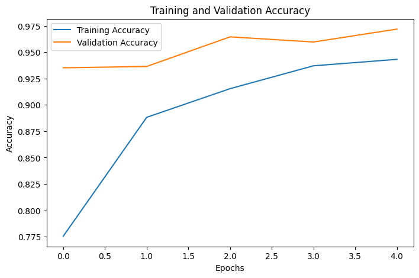
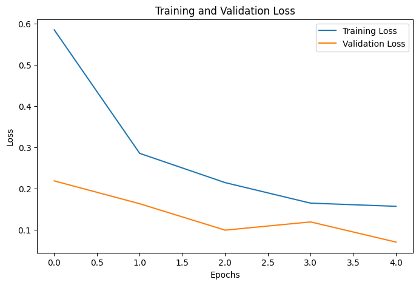
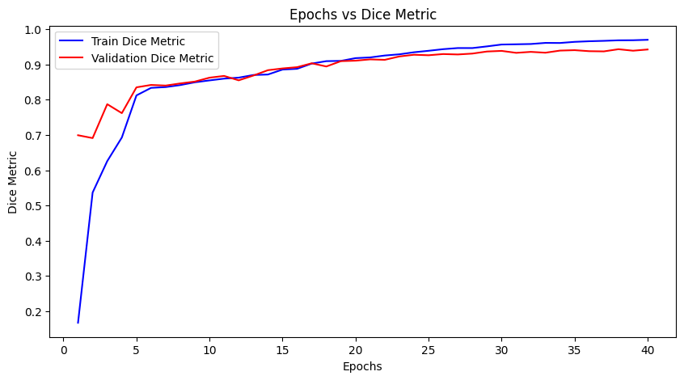
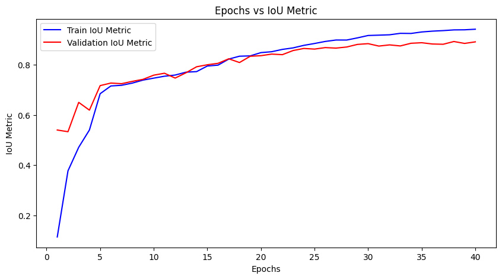
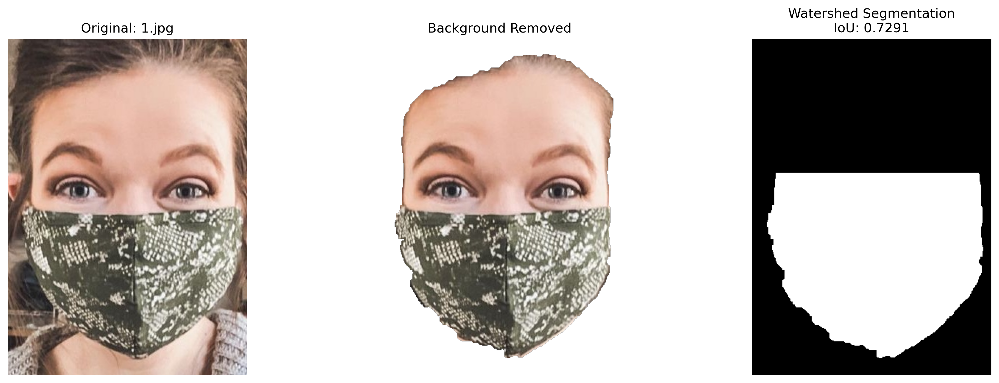
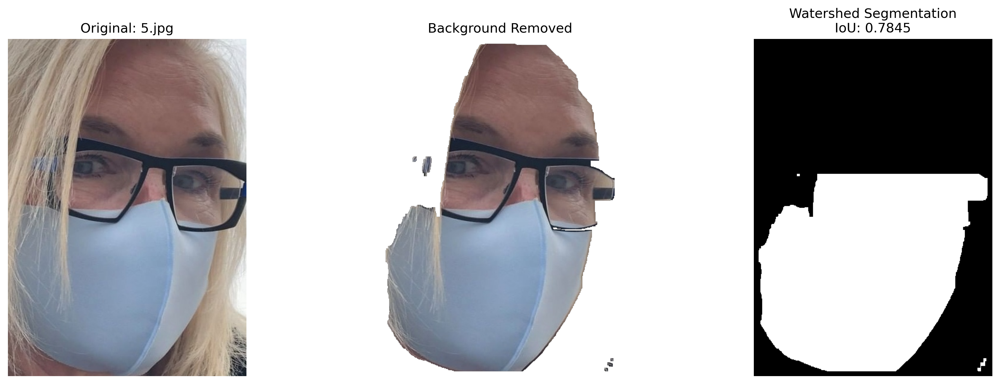
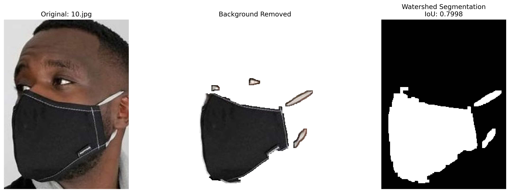

# VR Mini Project 1 : Face Mask Detection, Classification, and Segmentation

## Introduction
The 2 main objectives of the project were as follows:
- Binary classification of images (with or without mask) using handcrafted features and traditional models(SVM and Neural Networks) and also by using CNNs.
- Facemask Segmentation using traditional techinques like watersheding and U-Net

## Dataset

- The first dataset which is used for binary classification tasks, contains around 2000 images each for faces with and without masks with variations in size, lighting, gender, pose, etc.
- The dataset provided for the Segmentation task had around 9000 images along with Segmentation mask for each of the image.  

## Methodology

### Part a and b - Binary Classification Tasks
1. **Preprocessing and Feature Extraction**:
   - We extract **Histogram of Oriented Gradients (HOG)** features after converting images to grayscale and resizing them to 64x64 pixels.

2. **Model Training**:
   - **Support Vector Machine** with an RBF kernel
   - **Neural Network**: We used a Multilayer Perceptron (MLP) with three hidden layers of sizes 100, 50, and 50, ReLU activation, and optimized using Adam with a constant learning rate.

- For the **CNN** part, we used the following best parameters: A sequential model with two convolutional layers of 64 filters each, followed by max pooling. This was followed by a dense layer with 256 neurons and a dropout layer (0.5 dropout rate). The model was trained using RMSprop with a learning rate of 0.001, binary cross-entropy loss, and accuracy as the evaluation metric.
### Part c - Segmentation using Watersheding
 - **Background Removal**: High-contrast images use thresholding and edge detection, while GrabCut is applied for refined segmentation.
- **Watershed Segmentation**: The processed images undergo watershed segmentation to refine object boundaries and separate the foreground. The extracted masks are then compared with ground truth using IoU for accuracy assessment.
### Part d - Segmentation using U-Net
- **Data Preparation**: Images and corresponding masks were loaded from directories, resized to 128×128, converted to RGB, and normalized. Masks were binarized and reshaped. The dataset was split into training (80%) and validation (20%) sets with a batch size of 16 for training.
- **U-Net Model Training**: A U-Net architecture was implemented with four encoder blocks using Conv2D (ReLU activation, 3×3 kernel, padding='same') followed by MaxPooling2D (2×2). The bottleneck consisted of 1024 filters, and the decoder used UpSampling2D with concatenation and convolution layers. The model was compiled using the Adam optimizer (learning rate 1e-3) with binary cross-entropy loss and IoU/Dice metrics.
- **Performance Evaluation**: IoU and Dice coefficients were calculated for each predicted mask. The mean IoU and Dice scores across the validation set were computed and reported to assess segmentation accuracy.

## Hyperparameters and Experiments

We optimized all three models through extensive hyperparameter tuning. For the models in Part A, we used Randomized Search to fine-tune parameters such as different hidden layer sizes, activation functions, and learning rates. For the CNN, we utilized Keras Tuner to explore different architectures, adjusting the number of filters, kernel sizes, optimizers, batch sizes, and other key hyperparameters.
A simplified U-Net architecture with only three encoder and decoder layers was experimented with to reduce computational time. However, this modification resulted in a significant drop in IoU, indicating that the deeper architecture was crucial for achieving higher segmentation accuracy. 

## Results

### Classification

- SVM achieved an accuracy of 94% after hyperparameter tuning .
- Neural Network achieved an accuracy of 93% after hyperparameter tuning.
- The CNN model gave the highest accuracy of 97% after tuning.

Below are two graphs that show accuracy and loss over epochs for the CNN model.




### Segmentation

- Watershed segmentation performed poorly due to the blurry nature of the dataset, resulting in an average IoU of 0.2128 on the first 10 images.
- The U-Net model was trained and tested on the first 700 images, as the entire dataset was too large, leading to high training time.  
- U-Net segmentation achieved a training IoU of 0.9422 and a training Dice score of 0.9702, while the test IoU was 0.8321 and the test Dice score was 0.9053.

Below are two graphs that show dice score and IoU over epochs for the U-Net Model.



Below are 3 images of the segmented mask using watershed model 





## Observations and Analysis

###  Classification
- SVM and MLP may work well with smaller datasets. They do not capture the spatial feaures as CNN does which helps learning edge, texture, and shape hierarchies through the convolution layers, therefore it has the highest accuracy.
- SVM and MLP require manual feature extraction which may not capture complex features efficiently.
### Segmentation
- As expected, the U-Net architecture outperformed the traditional watershed technique, demonstrating significantly better segmentation accuracy.

## Steps to Run the Project

1. Ensure Dataset Structure  
Make sure you have the dataset organized as follows:  
```
dataset/
│── dataset1/
│   │── with_mask/       # Images with masks
│   │── without_mask/    # Images without masks
│
│── dataset2/
│   │── images/          # Input images
│   │── mask/            # Corresponding masks (same name as images)
classification.ipynb
segmentation.ipynb
```

2. Install Dependencies 
Run the following command to install the required dependencies:  
```bash
pip install opencv-python numpy tensorflow matplotlib scikit-learn tqdm scipy scikit-image keras keras-tuner
```

3. Run the Notebooks
Once the dependencies are installed and the dataset is set up, execute the provided Jupyter notebooks to train and evaluate the models.

## Contributions
- IMT2022073 Vasu Aggarwal : Completed Part C and contributed in writing readme
- IMT2022086 Ananthakrishna K : Completed Part D and contributed in writing readme
- IMT2022103 Anurag Ramaswamy : Completed parts A and B and contributed in writing readme

## Repository
The complete code for this project is available at:  [GitHub Repository - VR Mini Project 1](https://github.com/vr-assignments/VR_MiniProject1_IMT2022_073_086_103)
